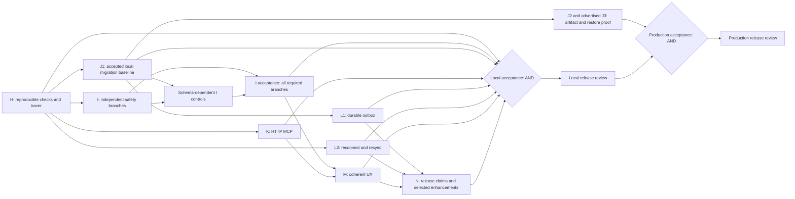

# Conductor: GPM working program, September 2026

Date: 2026-09-07. Status: **execution started; H-1 and H-2 complete locally**.
Mode: **DELIVERY**, continuing the existing declaration. Owner/architect/stakeholder:
Yannick Verrydt; AI agents prepare and review increments, and do not substitute
their acceptance for the owner's architectural decisions.

## Start here

1. Read [current architecture memory](architecture-memory.md).
2. Read the relevant finding in [the September baseline](current-state-review-2026-09-07.md).
3. Pull the first eligible task from [backlog.md](../../../backlog.md).
4. Resume at H-3-T1 using [accepted H-2 evidence and contracts](evidence/H-2-verification.md).
5. Read [independent validation](backlog-validation-2026-09-07.md) before treating the backlog as executable.

This program replaces the **remaining-work ordering** in the July development
plan and G0–G4 backlog. It preserves their completed work and history. H and I
are the first detailed epics; J–N below are a complete map of the remaining work,
kept at roadmap depth until their dependencies and decisions are ready. This
follows Backlog Builder's two-epic initial-depth rule, rather than inventing
detailed implementation contracts for unresolved architecture.

Execution update: the sandbox-specific package-resolution failure was diagnosed
without dependency changes; CI now uses guarded disposable fixtures and aligned
Node/Bun scripts. The final local suite passes 925 tests across 94 files; types,
lint and actual fixture doctor pass with documented warnings. H remains in
progress pending the daemon tracer and operating handoff. No hosted CI, production
build/deployment or later architecture gate is claimed complete.

## 1. Business context and release boundary

**Purpose (verified):** Conductor coordinates tasks executed by AI agents and
reviewed by people. Projects contain tasks and optional chains of TaskSteps.
Steps run through server HTTP adapters or a local daemon; external agents can
claim tasks through the pull API. The board, evidence, costs, and review gates
let an operator supervise that work. See [README](../../../README.md) and
[dispatch](../../../src/lib/server/dispatch.ts).

**Personas:** operator configuring and controlling work; reviewer assessing
results; maintainer diagnosing failures/upgrading the application; external-agent
integrator using the HTTP/CLI contracts. These are roles in the existing product,
not new account types.

**Planning assumption A-26-01:** local-first use by a trusted operator remains the
primary direction. A production/shared deployment is a separate release gate.
The user was offered a scope choice during this planning session; absent an
answer this is a recorded assumption, not owner approval of a release claim.
No cloud provider, SSO system, billing model, multi-tenant SaaS boundary, or HA
architecture is introduced.

Value hypotheses and proposed acceptance measures:

| Hypothesis | Evidence that would validate it | Boundary |
|---|---|---|
| Reproducible checks reduce diagnosis and rework. | One documented supported invocation passes the intended suite; a deliberately failing fixture fails CI; zero silently skipped required smoke checks. | Counts and coverage are measured anew; no target of reproducing an old test count. |
| Honest controls make supervision trustworthy. | A task control changes the documented execution state; heartbeat cannot reverse operator intent; late completion follows an approved policy. | Existing process execution is not claimed stopped merely because new dispatch is paused. |
| Tool and credential boundaries support safe delegation. | Member key-management requests are rejected; a disallowed tool is never invoked in either tested execution path. | Authenticated trusted-team use; this does not establish tenant isolation. |
| A newcomer can obtain a reviewed result without guessing prerequisites. | A clean-profile walkthrough configures a runtime, creates work, gets output, rejects once, then approves; UI explains each intentionally blocked state. | Usability completion is a measured journey, not a fabricated time-to-value statistic. |
| Reliable delivery and safe upgrades protect accumulated work. | Restart/retry fixtures preserve pending deliveries; upgrade/restore fixtures preserve rows and artifacts. | External effects are at-least-once unless the receiver honors a deduplication key. |

**Local release acceptance:** H and I accepted; local J schema safety accepted
before any schema-dependent change; K and L accepted for advertised integrations;
M's help/setup/workspace fixes accepted; every advertised but unimplemented N
feature either delivered or accurately scoped out in the UI/manual. The supported
Windows path is the development server until a separately tested local package
exists. It must not be advertised as a Windows production standalone installer.

**Production acceptance adds:** J container build/health, built-artifact browser
smoke, persistent-volume upgrade and restore, explicit deployment secrets, and
verification of each advertised database provider. Lack of an execution host
keeps this gate open. It does not stop local diagnosis, API fixes, protocol tests,
or schema-design work. A 1.0 version bump is a final release action, never proof
that the gates passed.

## 2. Current architecture, data, and interface boundaries

Verified repository shape: Next.js App Router with routed board/runtime/skills/help
views, TypeScript, Prisma, default SQLite, optional PostgreSQL/pgvector code paths,
Socket.IO sidecar, and a Bun daemon spawning shell-less CLI processes. Node runs
the application and doctor; Bun runs the test suite/tooling. The schema provider
is pinned to SQLite. There is no committed Prisma migration directory.

| Existing boundary (verified) | Relevant data/interface | Proposed change boundary (NEW) |
|---|---|---|
| Board to API to scheduler | `Task.status`, `TaskStep.status`, leases; `PUT /api/tasks/[id]`; batch mutation path | Guard unsupported chained-task moves first. Persistent lifecycle and cancel semantics require D-26-03; do not introduce a new endpoint or enum as though it exists. |
| Agent API and execution eligibility | `Agent.isActive`, `lastSeen`; heartbeat and queue queries | Distinguish operator intent from presence. Reuse versus new column is a decision, with compatibility tests and J migration dependency if needed. |
| Session and credential management | `requireAdminSession`, `requireRole`; owner/admin/member; scoped keys | Enforce existing role semantics and origin checks. A new authorization architecture is out of scope. |
| App to daemon to CLI | Execution Payload v2; completion route; server Finalizer; session events | Preserve current fields, add a versioned tool-policy contract if required, reject unsupported restrictions safely. Fencing late results needs an explicit version/compatibility decision. |
| HTTP adapters to MCP | connection endpoint/config/scopes; mode allowlist; `tools/list`, `tools/call` | Implement initialization, session lifecycle, Streamable HTTP and env-indirected headers with contract tests. No stdio or legacy SSE expansion in K. |
| Triggers to reactions | inline calls; reaction failure counters | Durable outbox (NEW table) after approved migration lane; delivery identity, per-reaction outcome, retry/backoff and recovery UI. |
| Socket to board cache | events patch local state; finite reconnect attempts | Renew credentials when needed, reconnect with bounded backoff and authoritative state resync; no mandatory cache-library migration. |

Canonical terms: **Agent** is a configured worker; **Runtime** is its model/provider
binding; **Daemon** is an external worker process; **Runner** spawns the CLI;
**Chain** is the task's step sequence/DAG; **Review gate** is a human sign-off step;
**Workspace** is the database container, distinct from the filesystem working
directory. `HTTP` and `DAEMON` are existing invocation enum values. Pull agents
are a third behavior, not an existing `EXTERNAL` enum value. `human` is a step
mode, not an Agent invocation enum.

Preserved July completion: G0 runtime/type/build corrections, G1 daemon
prompt/context/retry/fallback/execution-cost plumbing, G3-1 skill consumption,
and G3-2 skill CRUD/embedding-on-save. Historical completion is not fresh end-to-end
proof. TD-018b/TD-025 are not reopened as missing implementations; G1-1-T5 remains
an evidence/reliability gap. The current Bun failure is not proven to be the
previous TD-014b mock-isolation failure.

## 3. GPM execution and agent chain

The following collection agents were actually invoked as separate agents during
this planning pass. Their source files were loaded, not just their names reused.
Collection root: `C:/Projects/ClaudeExtras/01-agents`.

| Agent definition | Planning responsibility | Artifact |
|---|---|---|
| `gpm/current-state-evaluator-agent.md` | Reconcile code, old claims, and current evidence without fixing application code. | September baseline |
| `gpm/backlog-builder-agent-v2.md`, plus `library/backlog-product/backlog-builder-policy-kernel.md` and annexes | Produce dependency-aware H/I stories/tasks from the review and bounded target. | Root backlog |
| `gpm/gpm-partner-agent-v2.md`, prompt-generation mode | Draft the first SPIKE prompt; do not execute it. | H-1-T1 prompt |
| `library/backlog-product/backlog-critic-agent.md` | Independently validate the package, require concrete corrections, then recheck them. | Validation report |

Root coordinator owns this program, reconciles recommendations, maintains entry
points, and applies corrections. Agent definitions are used through Codex's
available agent runtime; this is not a claim that external Claude processes ran.

Future implementation follows:

1. **Foundation/refinement:** verify the task's sources and decisions. An approved
   contract snapshot is a pull gate, not a document to invent at execution time.
2. **SPIKE/PREP:** investigate uncertainty or restructure while preserving behavior.
3. **ZAP:** implement one bounded component, tests before business-logic changes.
4. **CIP:** wire accepted components, test the integrated journey and failures.
5. **Acceptance/retro:** independently check DoD; produce snapshot, integration
   note, evidence, runbook changes and phase summary; refine the next epic.

WIP limit: one implementation task, including unfinished verification. Parallel
agents may inspect independent areas; schema changes, shared lifecycle behavior,
and dependent edits stay sequential. A blocked task moves to an explicit blocked
lane, with the next *independent* eligible task pulled. No broad unrelated
refactoring, automatic deployment, or external messages are part of this plan.

Per [Delegation Charter](../gpm-deployment-kit-v1.md#6-delegation-charter--model-routing-with-guardrails):
Tier **R** handles design, diagnosis, backlog and adversarial review; **X** implements
clear specs and writes docs; **V** emits check results only. A V-tier check does
not author production code or runbook changes. These are capability recommendations,
not a claim to have run a different model. Task context target is <=3,000 tokens;
task output <=15,000 tokens, <=1,500 LOC and <=3 complex modules. A larger task
is refined before pulling. Story sizes are relative S/M/L, never calendar promises.

## 4. Release roadmap and dependency map

Only H/I are task-decomposed in the initial backlog. Every J–N candidate is
**HOLD FOR REFINEMENT**, not ready for code generation. Titles below are complete
scope coverage, not silently accepted contracts.

| Epic / candidate work | Outcome and proposed acceptance | Dependencies / gate | Existing origin |
|---|---|---|---|
| **H — Reproducible verification and daemon tracer** | Supported test/doctor/CI invocations agree; isolated fixtures drive an actual process and prove lease, output, attempts, retry and failure recovery. | Root H-1-T1 diagnosis first; no paid LLM or Docker needed for local fixture proof. | G0, G1-1-T5, new R-01/R-12 |
| **I — Execution and access safety** | Task-control semantics are explicit; heartbeats preserve intent; key management uses role checks; cookie mutations/reset handling are protected; daemon tool restrictions match the approved policy. | H evidence; D-26-03/04/06; schema-dependent tasks additionally require J local migration acceptance. Non-schema security fixes need not wait for that lane. | G4-2/3, GS-1/2/4, R-05 |
| **J — Safe schema evolution and deployment** | J-1: approved SQLite migration baseline on empty and copied existing databases, tested backup/restore, no destructive boot flags. J-2: verify container build/volume/health and browser smoke against built output. J-3: separately validate PG schema/provider/pgvector installation or limit the support claim. | D-26-02; H toolchain evidence. J-1 can be refined as soon as H diagnosis is complete; it does **not** depend on I completing. J-2/3 require suitable actual hosts/services. | G2-1/2/3/4, TD-024 |
| **K — Working HTTP MCP** | K-1: initialization, session negotiation/expiry, Streamable HTTP JSON/SSE responses and explicit unsupported-transport errors. K-2: env-indirected auth, URL/redirect protection, discover/call failure visibility and consistent tool restrictions. Contract test against an owned local fixture. | H; existing ADR-0005 amended/protocol ADR proposed; D-26-06; no dependence on a hosted MCP vendor. | G3-3, GS SSRF fold-in |
| **L — Reliable reactions and reconnect** | L-1: transactional event-to-delivery enqueue persists per-event/per-reaction work; retries survive restart; terminal failure/requeue visible; independent reactions do not vanish behind an unrelated failure. Reactions consuming earlier outputs preserve output/order dependencies, with an explicit blocked/skipped outcome after predecessor failure. L-2: reconnect refreshes expired auth and authoritative project state without applying stale-project results. | L-1 needs J-1 + approved outbox contract; L-2 needs H and can proceed independently. | G3-5, GS-6 |
| **M — Coherent first-use and navigation** | M-1: setup explains runtime, agent enablement, automation and tool prerequisites; canonical review destination and help match behavior. M-2: workspace switch filters project navigation and preserves valid selection; no new tenant security claim. M-3: documented examples, env setup, empty states, error toasts and keyboard flows verified in browser. | H/I; D-26-05; do not hardwire pending lifecycle decisions into UI. Accurate current help can be corrected earlier. | G4-1/4/6, G3-6, TD-022/005 |
| **N — Product completeness and optional enhancements** | N-1: cross-project rollups with explicit cycle/review-wait/rejection/cost definitions. N-2: cost provenance, unknown-cost display and honest budget limitations. N-3: skill history, queue view/live cursors, template/library simplification only after value/scope decision. N-4: targeted runner/output/wizard improvements from the debt register. | H; J for new schema; D-26-07 for optional items. Maintain accurate claims before release even when features are deferred. | G3-4, G4-5, TD-026/020/019/017/016/013 |

Recommended pull order after H: non-schema I safeguards and permission fixes;
J-1 local migration preparation when needed; remaining I controls; K; L; M;
N's release-claim work. J's host-dependent deployment verification is a separate
track, joined at production acceptance. This is a dependency order, not a calendar.

The diagram's acceptance/join nodes are dependency labels, not additional task
IDs. Each AND join requires **all** incoming evidence, not whichever branch
finishes first. IS is required if schema-dependent controls are in the approved
release scope; otherwise an explicit scope decision documents their absence,
and no such control is advertised. No J task depends on completion of the
schema-dependent I tasks it unblocks. J3 evidence applies to every advertised
provider; unverified PG support must be scoped out explicitly.

## 5. Decisions and assumptions ledger

These gates apply to dependent **implementation**, not to completing the plan.
No decision below is marked accepted merely because a draft recommends it.
Decision owner is Yannick; review at the next refinement before the named work.

| ID | Impact / proposed direction | Status and required decision | Work gated |
|---|---|---|---|
| D-26-01 / A-26-01 | High: local-first versus production-first release. | ASSUMED local-first after optional scope question; reaffirm before release commitments. Historical lack of Linux/Docker is not a permanent fact. | Production claims and J-2/3 scheduling, not H |
| D-26-02 | High: safe SQLite schema baseline, PG separate lane. | PROPOSED: prepare/approve migration ADR (July ADR-0009 proposal remains unfinished), establish SQLite baseline first; no new `db push` waiver inferred. Explicitly resolve old G3-5 outbox hold. | All new schema, including paused/control fields, outbox and history |
| D-26-03 | High: task lifecycle and operator intent. | PROPOSED: refuse unsupported active-chain drags immediately; Pause prevents new execution; in-flight execution may finish visibly; Cancel requires explicit late-result/fencing semantics. Choose existing `isActive` reinterpretation versus additive intent fields with migration. | Lifecycle code beyond agreed safe guard; cancellation must not be presented as process termination |
| D-26-04 | High: legacy credential compatibility. | PROPOSED: admin role for key management immediately; inventory active legacy/unbound keys without revealing secrets, then approve an explicit migration/sunset policy. Do not assume no existing users. | Legacy key rejection/session invalidation; no automatic production rotation |
| D-26-05 | Medium: Waiting/Review vocabulary. | PROPOSED: one understandable attention destination; decide UI aggregation versus stored-status/API change before migration or integrator breakage. | Changed status semantics; truthful documentation need not wait |
| D-26-06 | High: tool policy and rollback. | PROPOSED: explicit connection/mode restrictions intersect; connection scopes=[] retains deny-all and null legacy scope is distinguished. An empty mode allowlist currently bypasses narrowing; decide preservation versus migration explicitly. Unsupported daemon clients fail closed for restricted work. CLI/tool compatibility requires a local fixture spike. A feature switch must not restore unrestricted access. | Daemon payload/CLI enforcement; auth and endpoint policy contract |
| D-26-07 | Medium: optional scope. | Skill history, template/library redesign, live cursors and additional runners remain optional. Cross-project KPIs retain the July intent to implement, with scope/metric confirmation at refinement. | N feature expansion, not honest claim cleanup |
| A-26-02 | Medium: existing single-instance polling architecture sufficient. | ASSUMED from ADR-0006; measure queue delay/saturation before selecting a broker or HA design. | Horizontal scale work excluded |
| A-26-03 | Medium: proposed SLOs and sizing are useful starting targets. | ASSUMED; measure on a named host/fixture. No observed throughput, coverage, cycle-time percentile or delivery date is invented. | Performance acceptance thresholds require calibration before execution |

## 6. Risks, data, and delivery safeguards

No High/Medium risk is silently accepted. Mitigations and decision gates below
are planned, not completed. Review date: **2026-09-14 or before affected work is
pulled, whichever occurs first**. Owner: Yannick with the relevant implementer.

| Risk | Severity | Mitigation / evidence required |
|---|---|---|
| A diagnostic/runtime failure is mistaken for dozens of product defects. | High | H-1 isolated reproduction, supported-runtime matrix, classified failures and unchanged baseline evidence. |
| Upgrade loses data or invalidates the generated provider contract. | High | J-1 approved ADR, copied/synthetic fixtures, forward migration, backup restore, refusal on divergence; no destructive fallback. |
| Pause/cancel races with a lease or late completion. | High | I lifecycle design, compare-and-set/fencing decision, both execution paths and pull claims tested before exposing controls. |
| Tool restriction UI promises more than the CLI actually enforces. | High | I owned MCP fixture demonstrates denied tools never execute; unsupported policy fails closed. |
| Credential compatibility or rollback restores excessive permissions. | High | Role matrix, legacy inventory, explicit sunset decision; disable affected operation/worker on emergency rollback rather than restore unsafe behavior. |
| Retried reaction duplicates an external side effect. | High | L delivery key stable across retry; receiver idempotency contract or visible at-least-once semantics; never promise universal exactly-once delivery. |
| Docker absence is used to declare success or to stall all local work. | Medium | Separate J host gate; H fixture proof and J-1 local baseline have their own evidence. |
| A mocked green suite hides broken workflows or resource leaks. | Medium | H real subprocess/DB/API fixture, explicit exit/cleanup assertions, no no-op mock used to suppress a failed behavioral assertion. |
| Planning expands into a platform rewrite. | Medium | WIP-1, two detailed epics, scope gates for new providers/queues/cache frameworks; refine based on measured pain. |

Data classification: source/configuration schemas and synthetic fixtures are
internal; prompts, task output, project exports and user names/emails can be
confidential; raw credentials and tokens are restricted. No named compliance
regime was supplied; this plan claims no GDPR or other certification. A DPIA-lite
at relevant auth/outbox/analytics refinement records fields, purpose, access,
retention and deletion rather than guessing a legal regime.

Test data is synthetic/anonymized and isolated from the live SQLite database.
Never copy raw credentials into snapshots, console output, exported fixtures or
agent prompts. Existing retention controls remain; proposed outbox/metrics/history
retention must be specified before new persistent data ships. Retained review/test
evidence is secret-scrubbed; owners set a retention period in the runbook.

Every write-changing task specifies identity/idempotency, conflict response and
retry behavior. Migration rollback means a tested restore or compatible forward
repair; a destructive down migration is not presumed safe. User-facing optional
rollouts have named flags; security and lifecycle invariants remain enforced with
flags off. No blanket safety-bypass toggle is an acceptable rollback.

## 7. Verification, operations, and release evidence

Five layers are allocated by risk, not repeated mechanically for documentation:
unit tests for new logic (measure >=80% new logic); consumer/provider contracts for
MCP and daemon payloads; integration/API tests with actual isolated persistence;
critical browser/process E2E; and performance evidence on named fixtures. Pure
documentation changes use link/content review, not new tests that mirror prose.

Existing logs, StepEvents, StepExecutions, and OTel spans are the observation
surface. No new telemetry vendor is selected. Each epic's runbook states symptoms,
checks, actual signals, recovery, safe rollback, and evidence location. Record
latency, completed/failed requests, queue depth/age, and execution concurrency;
trace task/step/execution/delivery identities across boundaries without secrets.

**Proposed targets, not measured achievements:**

- Daemon fixture — one full lease/spawn/completion journey <180 seconds per local
  smoke run after startup, on the recorded test host; separately record startup.
- Local control API — p95 <500 ms over 100 synthetic requests with 500 task rows,
  excluding external model execution; no accepted operation violating the approved
  lifecycle contract in the adversarial fixture set.
- Realtime recovery — authoritative board resync <10 seconds over 20 reconnect
  trials after the service becomes available, on the reference local fixture.
- Outbox worker — 100% of acknowledged fixture deliveries remain recoverable over
  20 forced restarts; external completion latency is reported separately.

Backlog epic-specific targets govern H/I. If a target is unsuitable, record a
calibration decision before accepting performance work; never change it after a
failed run just to call the run green. Existing [SLOs](../../ops/slos.md) distinguish
structural safeguards from measured service levels; preserve that distinction.

Release evidence includes command/version/OS/exit code, intended test selection,
counts and failures, coverage scope, fixture identities, browser traces,
daemon completion/failure artifacts, and migration/restore results. The owner
accepts a release only after the required profile is proven. Seven-dimension
evaluation is rerun with UNKNOWN where no measurement exists; a made-up A+ score
cannot substitute for release evidence.

## 8. Traceability and retained enhancements

| September finding | Planned destination | July linkage / disposition |
|---|---|---|
| R-01 verification/CI | H | G0 fixes preserved; current environment failure diagnosed independently |
| R-02 task moves | I | G4-2 |
| R-03 presence versus intent | I | G4-3 |
| R-04 key permissions | I | GS-1; GS-2/4/3/5 additional auth hardening kept in scope refinement |
| R-05 daemon tool scopes | I | New gap in G1 MCP work; no claim full tool-policy parity is complete |
| R-06 HTTP MCP | K | G3-3 |
| R-07 upgrades/deploy | J | G2, TD-024; SQLite contention measured before prescribing configuration |
| R-08 reactions | L-1 | G3-5, schema decision retained |
| R-09 reconnect | L-2 | GS-6 |
| R-10 workspace navigation | M-2 | G4-6 |
| R-11 help/KPIs | M-1/3, N-1 | G4-1/4, G3-4/6 |
| R-12 daemon E2E | H | G1-1-T5 |
| R-13 stale planning memory | Planning package + each epic closeout | Historical evidence retained; current entry points corrected |
| R-14 missing operational/product measures | H evidence + M walkthrough + N definitions | No invented velocity or delivery forecast |

Retained optional debt: skill version history (TD-026); cost precision (TD-020);
long output/artifact access (TD-019); command-template validation and quoted argv
(TD-016/017); wizard timeout/search/prerequisite feedback (TD-013/011/012);
workspace-less dispatch dedupe (TD-015); prompt archive recursion/cache freshness
(TD-002/003); toast and keyboard verification (TD-022/005). TD-023's cache-framework
replacement remains deferred absent demonstrated need. These are N/M refinement
inputs, not invisible deletion of the debt register.

## 9. Next action and planning acceptance

The concrete next task is **H-1-T1: reproduce and classify verification failure**.
It produces a bounded diagnosis and recommendation; H-1-T2 performs only the
supported repair selected from that evidence. No architecture, schema migration,
production rollout, or credential mutation is authorized by marking a planning
document complete.

The independent critic report records actual findings and resolutions. H/I tasks
marked HOLD remain held after the planning package is delivered. At each epic
retro, update the current-state facts, retain old IDs in traceability, refine the
next epic, and check that the first eligible task is still the correct one.
